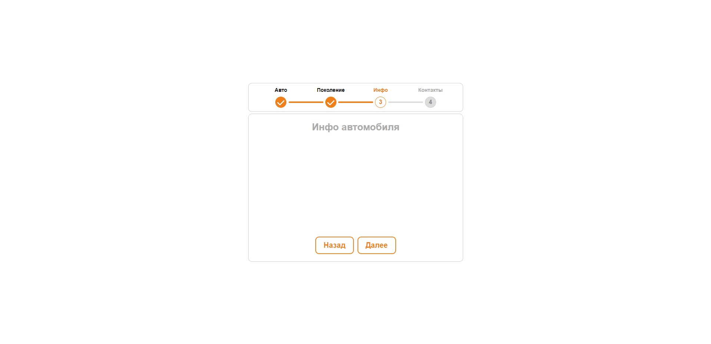

# Stepper for web

This is component for website

## Table of contents

- [Overview](#overview)
  - [The challenge](#the-challenge)
  - [Screenshot](#screenshot)
- [My process](#my-process)
  - [Built with](#built-with)
- [Author](#author)

## Overview

### The challenge

Users should be able to:

- See hover and focus states for all interactive elements on the page

### Screenshot

## My process

### Built with

- Semantic HTML5 markup
- CSS custom properties
- Flexbox
- CSS Grid
- JavaScript
- Mobile-first workflow

## Author

- Website - [Anton Yermakovich](https://portfolio-antonyermakovichs-projects.vercel.app/)
- Telegram - [@anton_yermakovich](https://t.me/anton_yermakovich)
